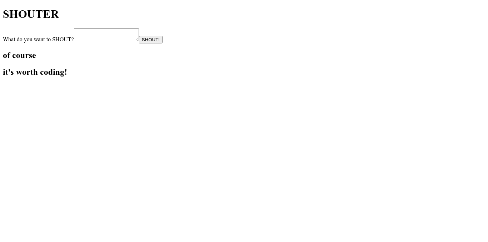

# Shouter (exercise project from tutorial)

This is a clojure backend project that behave like social media post, following the tutorial from https://devcenter.heroku.com/articles/clojure-web-application. It used MVC architecture. This project is the simpler layout of https://github.com/technomancy/shouter. Here I used newer version of library.


## API Reference

#### Get all shouts

```http
  GET /
```

#### Submit the shout

```http
  POST /
```

| Parameter | Type     | Description                       |
| :-------- | :------- | :-------------------------------- |
| `shout`      | `string` | **Required**. Submitted shout from form. |

## Screenshots



## License

Copyright Aaron Bedra

Distributed under the Eclipse Public License, the same as Clojure.
